# PES-VCS: Version Control System from Scratch

Sneha Jisho | `PES2UG24CS507`  
**Platform:** Ubuntu 22.04  
**Repository:** PES2UG24CS507-pes-vcs

---

## Table of Contents

1. [Project Overview](#project-overview)
2. [Phase 1: Object Storage Foundation](#phase-1-object-storage-foundation)
3. [Phase 2: Tree Objects](#phase-2-tree-objects)
4. [Phase 3: The Index (Staging Area)](#phase-3-the-index-staging-area)
5. [Phase 4: Commits and History](#phase-4-commits-and-history)
6. [Integration Test](#integration-test)
7. [Analysis Questions — Branching & Checkout](#analysis-questions--branching--checkout)
8. [Analysis Questions — Garbage Collection](#analysis-questions--garbage-collection)

---

## Project Overview

PES-VCS is a local version control system built from scratch in C, modeled after Git's internal design. It implements content-addressable object storage, a staging area (index), tree-based directory snapshots, and a linked commit history — all stored under a `.pes/` directory in the working folder.

The five commands implemented are:

```
pes init              # Create .pes/ repository structure
pes add <file>...     # Stage files (hash + update index)
pes status            # Show modified/staged/untracked files
pes commit -m <msg>   # Create commit from staged files
pes log               # Walk and display commit history
```

The `.pes/` directory structure mirrors Git's `.git/`:

```
.pes/
├── objects/          # Content-addressable blob/tree/commit storage
│   ├── 2f/
│   │   └── 8a3b...   # Sharded by first 2 hex chars of hash
│   └── a1/
│       └── 9c4e...
├── refs/
│   └── heads/
│       └── main      # Branch pointer (commit hash)
├── index             # Staging area (text file)
└── HEAD              # Current branch reference
```

---

## Phase 1: Object Storage Foundation

### What Was Implemented

**`object.c`** implements the core content-addressable storage layer — the foundation everything else is built on.

**`object_write`** stores any object (blob, tree, or commit) in the object store:
- Prepends a type header in the format `"<type> <size>\0"` to the raw data
- Computes a SHA-256 hash of the full object (header + data)
- Shards storage into subdirectories using the first 2 hex characters of the hash (e.g., `.pes/objects/a1/9c4e...`) to avoid oversized flat directories
- Writes atomically: first to a temp file, then renames — this guarantees no partial writes are ever visible

**`object_read`** retrieves and verifies objects:
- Reads the file at the path derived from the given hash
- Parses the header to extract the object type and declared size
- Recomputes the SHA-256 and compares it against the filename — any corruption is detected
- Returns only the data portion (after the null byte separator)

### Key Concepts

- **Content-addressable storage**: The hash of an object's content is its name. Identical content always maps to the same hash, giving deduplication for free.
- **Atomic writes**: Using a temp-file-then-rename pattern ensures the object store is never left in a partially-written state, even if the process crashes mid-write.
- **Directory sharding**: Splitting the object store into 256 subdirectories (by first 2 hex chars) prevents filesystem performance degradation that occurs with very large flat directories.

### Screenshot 1A — All Phase 1 Tests Passing

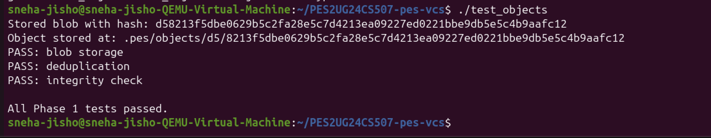

All three tests pass:
- **PASS: blob storage** — object_write correctly stores data and returns the hash
- **PASS: deduplication** — writing the same content twice returns the same hash and stores only one file
- **PASS: integrity check** — object_read detects a corrupted object by recomputing and comparing the hash

### Screenshot 1B — Sharded Object Directory Structure

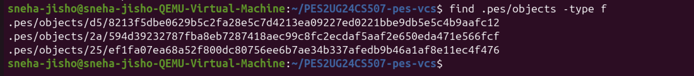

The object store shows the sharded directory layout. Each file path is `.pes/objects/XX/YYY...` where `XX` is the first two hex characters of the SHA-256 hash, and `YYY...` is the remaining 62 characters.

---

## Phase 2: Tree Objects

### What Was Implemented

**`tree.c`** implements tree object serialization, parsing, and construction from the index.

**`tree_from_index`** builds a complete tree hierarchy from the staged index:
- Iterates over all index entries, which may include nested paths like `src/main.c`
- Groups entries by directory, recursively creating subtrees for nested paths
- Serializes each tree and writes it to the object store using `object_write`
- Returns the SHA-256 hash of the root tree object

**`tree_serialize`** converts a `Tree` struct into the binary wire format:
- Sorts entries by name (deterministic output regardless of insertion order)
- Each entry is formatted as: `"<mode> <name>\0<20-byte-binary-hash>"`
- Writes mode as an octal string (`100644`, `100755`, `040000`)

**`tree_parse`** reconstructs a `Tree` struct from raw bytes.

### Key Concepts

- **Tree objects represent directories**: A tree is a sorted list of entries, each pointing to either a blob (file) or another tree (subdirectory). This allows the entire project snapshot to be encoded as a single root tree hash.
- **Deterministic serialization**: Sorting entries by name ensures that two trees with the same content always produce the same hash, regardless of the order entries were added.
- **Recursive structure**: Deeply nested directories (e.g., `a/b/c/file.txt`) are represented as nested trees, with each level pointing to the level below.

### Screenshot 2A — All Phase 2 Tests Passing

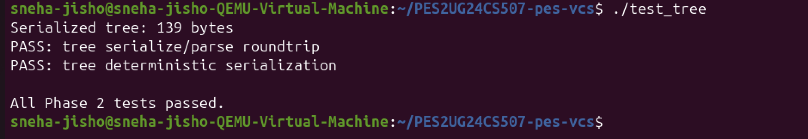

Both tests pass:
- **PASS: tree serialize/parse roundtrip** — a Tree struct survives a full serialize → parse cycle with all entries, modes, and hashes preserved
- **PASS: tree deterministic serialization** — the same entries in any order produce identical binary output

### Screenshot 2B — Raw Binary Format of a Tree Object

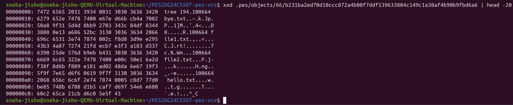

The `xxd` dump of a tree object from the object store. The file begins with the ASCII header `tree 194` followed by a null byte, then the binary entries. Each entry starts with the mode string (e.g., `100664`), a space, the filename as ASCII, a null byte, and then 32 bytes of raw binary SHA-256 hash. The non-printable binary hashes are visible in the hex columns on the left.

---

## Phase 3: The Index (Staging Area)

### What Was Implemented

**`index.c`** implements the staging area — the preparation zone between the working directory and the object store.

**`index_load`** reads `.pes/index` into an `Index` struct:
- If the file does not exist, initializes an empty index (not an error — expected for a fresh repo)
- Parses each line in the format: `<mode> <hash-hex> <mtime> <size> <path>`

**`index_save`** writes the index atomically:
- Sorts all entries by path before writing, for deterministic output
- Writes to a temp file first, calls `fsync()` to flush to disk, then renames atomically

**`index_add`** stages a single file:
- Reads the file contents from the working directory
- Calls `object_write` to store the file as a blob in the object store
- Updates or inserts the index entry with the new hash, mtime, and size

### Key Concepts

- **The index decouples working directory from commits**: You can stage only some of your changes. `pes commit` snapshots the index, not the working directory.
- **Atomic index writes**: Using fsync + rename ensures the index is never partially written. A crash between writes leaves the old index intact.
- **Metadata for change detection**: Each index entry stores `mtime` and `size`. `pes status` uses these to quickly detect modifications without re-hashing every file.

### Screenshot 3A — init → add → status Sequence

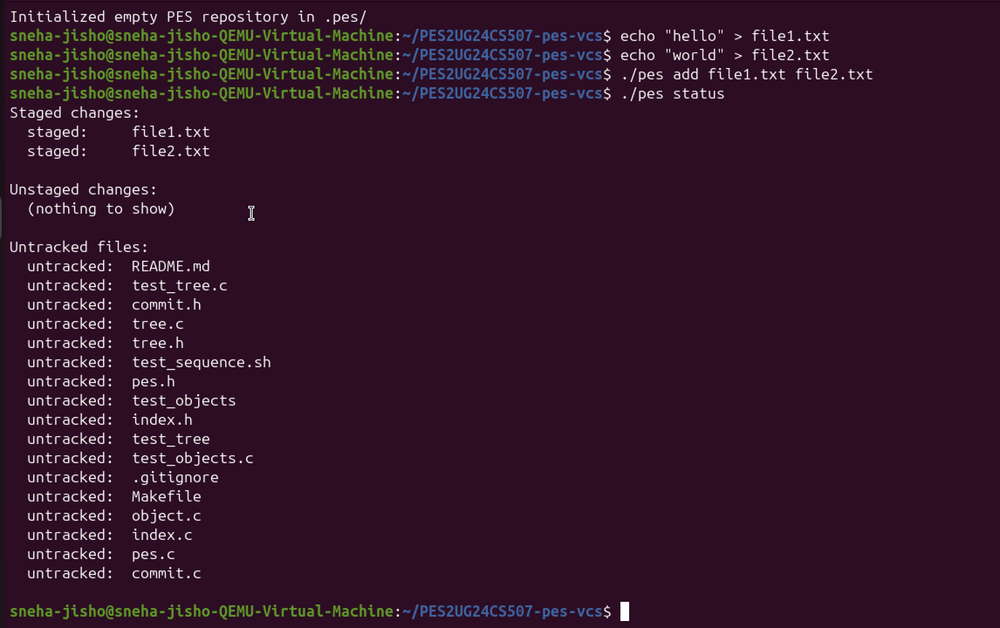

The output shows:
- `pes init` successfully created the `.pes/` repository
- `pes add file1.txt file2.txt` staged both files
- `pes status` correctly reports both as `staged` under "Staged changes", with "Unstaged changes" showing nothing and source files appearing as untracked

### Screenshot 3B — Index File Contents

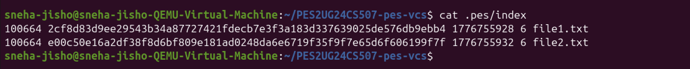

The `.pes/index` file is a human-readable text file. Each line contains:
- File mode (`100664`)
- SHA-256 hash of the blob (hex)
- mtime timestamp (Unix epoch)
- File size in bytes
- File path

---

## Phase 4: Commits and History

### What Was Implemented

**`commit.c`** implements commit creation and history traversal.

**`commit_create`** is the main commit function:
1. Calls `tree_from_index()` to build a tree object from the current staged state
2. Reads the current HEAD to find the parent commit hash (empty for the first commit)
3. Reads the author string from `pes_author()` (sourced from `PES_AUTHOR` env var, defaulting to `"PES User <pes@localhost>"`)
4. Serializes the commit object in the text format and writes it via `object_write`
5. Updates the branch ref file (`.pes/refs/heads/main`) with the new commit hash

The commit text format is:
```
tree <tree-hash-hex>
parent <parent-hash-hex>        ← omitted for root commit
author <name> <timestamp>
committer <name> <timestamp>

<message>
```

The parent pointer creates a singly-linked list of history stretching back to the initial commit, which has no parent.

### Key Concepts

- **Commits snapshot the index, not the working directory**: `tree_from_index()` reads the staged state. Unstaged changes are invisible to the commit.
- **Linked history via parent pointers**: Each commit stores its parent's hash, forming an immutable chain. `pes log` simply follows this chain until it finds a commit with no parent.
- **Atomic ref update**: Writing the new commit hash to `.pes/refs/heads/main` is done atomically (temp + rename), so HEAD always points to a valid complete commit.

### Screenshot 4A — `pes log` Showing Three Commits

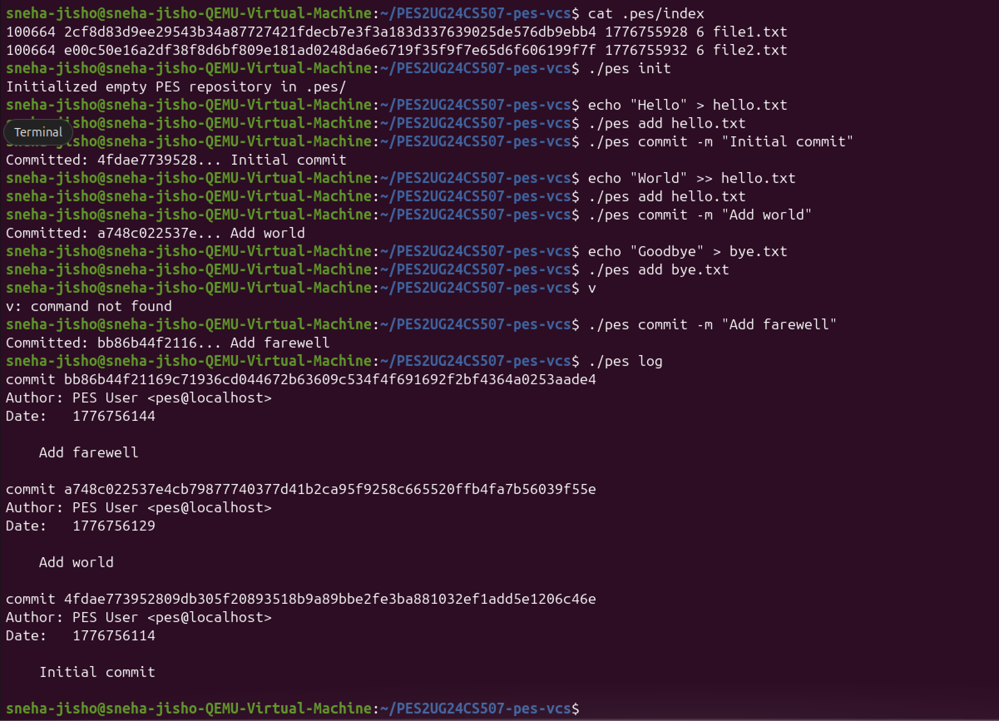

Three commits are shown in reverse chronological order, each with:
- Full SHA-256 commit hash
- Author (`PES User <pes@localhost>`)
- Unix timestamp date
- Commit message

The parent chain correctly links: "Add farewell" → "Add world" → "Initial commit"

### Screenshot 4B — Object Store Growth After Three Commits

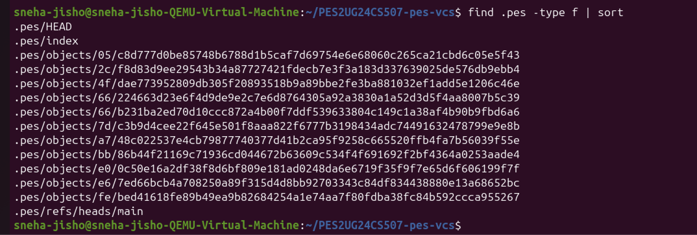

After three commits, the object store contains 11 objects plus `HEAD`, `index`, and `refs/heads/main`. The objects include blobs (file contents), trees (directory snapshots), and commits — all stored in sharded subdirectories.

### Screenshot 4C — Reference Chain

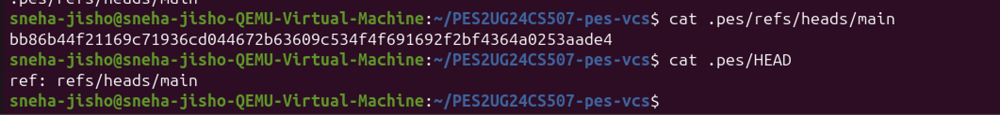

- `.pes/refs/heads/main` contains the hash of the latest commit
- `.pes/HEAD` contains `ref: refs/heads/main`, pointing to the branch

This two-level indirection means HEAD always follows the branch automatically on each new commit.

---

## Integration Test

### Screenshot — Full Integration Test

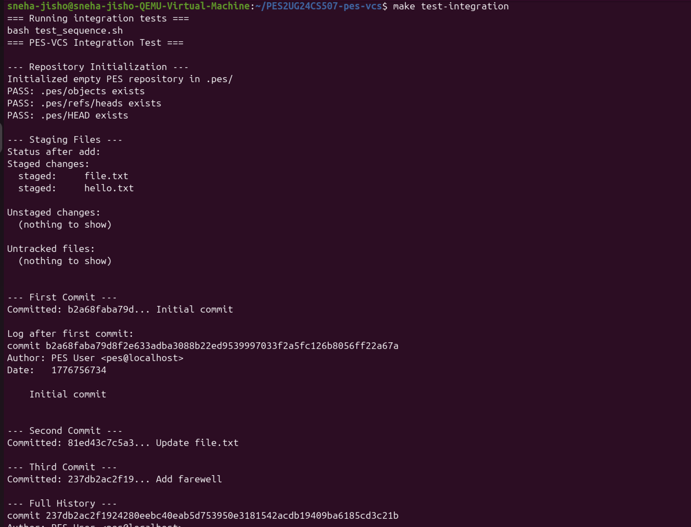
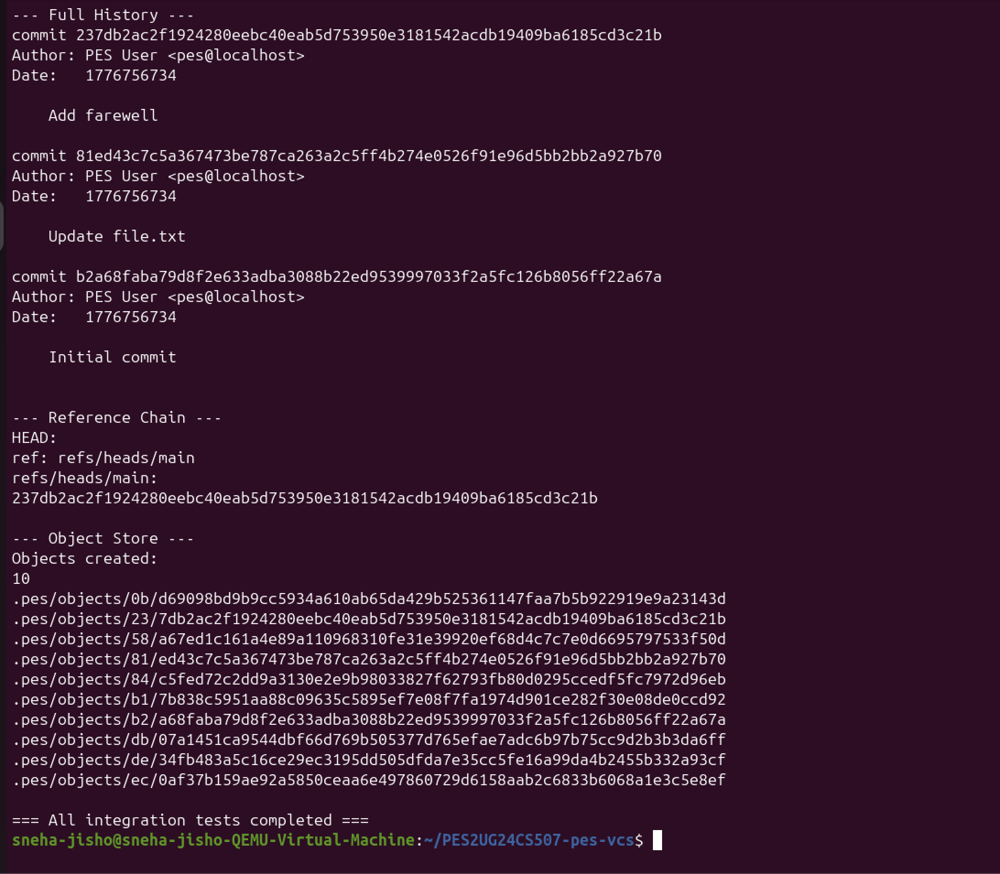

`make test-integration` runs `test_sequence.sh` end-to-end, verifying:
- Repository initialization (`.pes/objects`, `.pes/refs/heads`, `.pes/HEAD` all created)
- Staging files and checking status
- Three sequential commits with correct log output after each
- Full history walk showing all three commits
- Reference chain (`HEAD` → `refs/heads/main` → latest commit hash)
- Object store containing exactly 10 objects after three commits

**Result: All integration tests completed successfully.**

---

## Analysis Questions — Branching & Checkout

### Q5.1: How would you implement `pes checkout <branch>`?

To implement `pes checkout <branch>`, the following files in `.pes/` must change:

**HEAD update:** Rewrite `.pes/HEAD` to contain `ref: refs/heads/<branch>`. This is a single atomic file write.

**Working directory update:** Read the commit hash from `.pes/refs/heads/<branch>`, parse that commit object to get its tree hash, then recursively walk the tree and write every file to the working directory. Files present in the current tree but absent in the target tree must be deleted.

**Index update:** Replace the entire in-memory index with the entries from the target commit's tree (paths, modes, and hashes), then save it atomically.

**What makes this complex:**

- **Dirty file detection:** Before touching anything, you must check whether any tracked file in the working directory differs from the current index (modified but not staged) or the index differs from HEAD (staged but not committed). If so, checkout must refuse to overwrite those changes.
- **Partial failure:** If the process crashes halfway through writing the working directory files, the repo ends up in a mixed state. A real implementation uses a staging area during the write and commits atomically.
- **Untracked file conflicts:** If a file exists in the working directory that is untracked now but would be overwritten by the target branch's tree, checkout must refuse.
- **Directory creation/deletion:** Switching branches may require creating new directories or removing ones that no longer exist, which must be handled carefully.

---

### Q5.2: How do you detect a "dirty working directory" conflict when switching branches?

Using only the index and the object store, the detection algorithm is:

1. **Detect unstaged modifications:** For every entry in the current index, stat the corresponding working directory file. If `mtime` or `size` has changed since the index entry was written, re-hash the file and compare against the stored blob hash. A mismatch means the file is modified but not staged.

2. **Detect staged-but-uncommitted changes:** Compare each index entry's blob hash against the blob hash stored in the HEAD commit's tree for the same path. Any difference means a staged change that has not been committed.

3. **Cross-reference with the target branch:** For any file that is dirty (by either test above), check whether that file's blob hash in the target branch's tree differs from its blob hash in the current branch's tree. If it does, the checkout would overwrite a local change — refuse and report the conflict.

If no dirty file overlaps with a difference between branches, checkout can proceed safely. Files that differ between branches but are clean in the working directory are simply overwritten.

---

### Q5.3: What happens if you make commits in "detached HEAD" state? How do you recover?

In detached HEAD state, `.pes/HEAD` contains a raw commit hash instead of `ref: refs/heads/<branch>`. When `pes commit` runs, it reads HEAD directly and writes the new commit hash back to HEAD — but **no branch ref is updated**. The new commits exist in the object store and form a valid chain, but no named branch points to them.

If you then run `pes checkout main`, HEAD is updated to point to `main`, and the detached commits become **unreachable** — no ref points to them. They will eventually be deleted by garbage collection.

**Recovery options:**

- **If you remember the commit hash** (e.g., from terminal scroll-back): Create a new branch pointing directly to that hash by writing the hash into `.pes/refs/heads/<new-branch>`, then check out that branch.
- **Before GC runs**: Walk every file in `.pes/objects/` and parse each commit object. Build the full reachability graph from all known branch refs. Any commit not reachable from a branch is a candidate for recovery. This is what `git reflog` assists with in real Git.
- **Prevention**: Before entering detached HEAD state, create a new branch first, so all subsequent commits are tracked.

---

## Analysis Questions — Garbage Collection

### Q6.1: Algorithm to find and delete unreachable objects

**Algorithm (Mark-and-Sweep):**

**Mark phase** — find all reachable objects:
1. Start with a set `reachable = {}` and a queue initialized with every commit hash found in `.pes/refs/heads/` (all branch tips) and `.pes/HEAD`.
2. For each commit hash in the queue:
   - Add it to `reachable`
   - Parse the commit: add its tree hash and parent hash(es) to the queue if not already in `reachable`
3. For each tree hash in the queue:
   - Add it to `reachable`
   - Parse the tree: add every blob and subtree hash to the queue
4. For each blob hash in the queue:
   - Add it to `reachable`
5. Continue until the queue is empty

**Sweep phase** — delete unreachable objects:
1. Walk every file under `.pes/objects/`
2. Reconstruct each object's hash from its directory path (`XX` + filename)
3. If the hash is not in `reachable`, delete the file
4. Remove any now-empty two-character subdirectories

**Data structure:** A hash set (e.g., a hash table or sorted array of 32-byte hashes) for O(1) membership checks during the mark phase.

**Estimate for 100,000 commits and 50 branches:**

Assuming an average of 10 objects per commit (1 commit + ~3 trees + ~6 blobs), the object store holds roughly 1,000,000 objects. The mark phase visits each reachable object once, so roughly 1,000,000 object reads. The sweep phase scans all files on disk once. Total: approximately 2,000,000 operations — feasible in under a minute on modern hardware.

---

### Q6.2: Race condition between GC and a concurrent commit

**The race condition:**

Consider this interleaving:

1. **GC** begins its mark phase. It finds all reachable objects from current branch tips. Object `B` (a blob) is reachable from HEAD, so it is marked.
2. **Commit** begins. It writes a new blob `X` to the object store (not yet referenced by anything).
3. **GC** completes its mark phase. Object `X` was written *after* the mark phase started, so it is **not in the reachable set**.
4. **GC** begins its sweep phase and **deletes object `X`** — it looks unreachable.
5. **Commit** writes its tree object (which references `X`) and then its commit object, then updates the branch ref.
6. The repository now has a commit whose tree references a deleted blob. **The repository is corrupt.**

**How Git avoids this:**

- **Grace period / age threshold:** Git's GC (`git gc`) only deletes objects that are older than a configurable threshold (default: 2 weeks). Newly written objects are always younger than this threshold, so they are never deleted even if temporarily unreachable.
- **`pack-refs` and lock files:** Git uses lock files (`.lock` suffix) on ref files during both GC and commits, creating mutual exclusion at the ref-update step.
- **Two-phase with conservative marking:** Because the grace period makes the mark phase conservative (it keeps anything "young"), a newly written object is always safe even if GC runs concurrently.

The key insight is that GC must be *conservative* — it is always safer to keep an extra object than to delete one that is about to be referenced.
